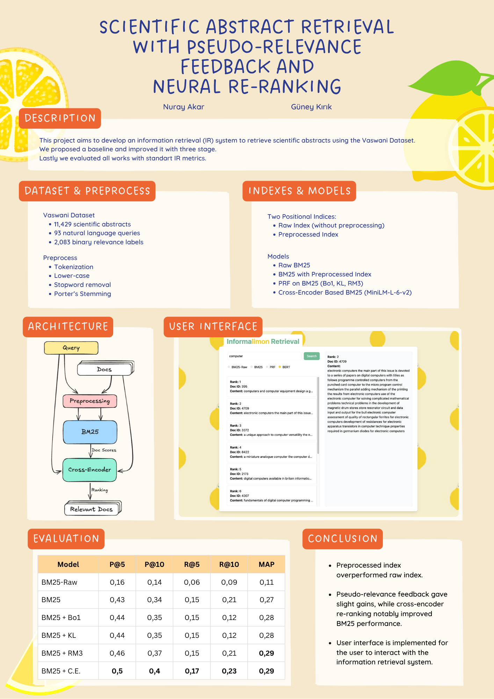

# CENG596 Term Project: Informa*limon* Retrieval

This project was developed as a term project for **Information Retrieval** course. It implements a basic retrieval system
using the BM25 model on both preprocessed and raw data. The system is further enhanced with
Pseudo-Relevance Feedback (PRF) to improve result quality and incorporates a BERT-based re-ranking model for more
accurate document ranking. A user-friendly web interface is developed, where users can enter a query and view the
retrieved documents for four configurations: BM25 on preprocessed data, BM25 on raw data, BM25 with PRF, and BM25 with
BERT re-ranking.

This project includes:

- A Django web application
- A Jupyter notebook (`.ipynb`)

Both components share the **same virtual environment** and use a common `requirements.txt` file.

---

## Installation

### 1. Clone the Repository

```bash
git https://github.com/ingeniararto/ceng596-limon/
cd ceng596-limon
```

### 2. Create and Activate a Virtual Environment

```bash
# Create a virtual environment
python -m venv venv

# Activate the virtual environment

# On Windows:
venv\Scripts\activate

# On macOS/Linux:
source venv/bin/activate
```

### 3. Install Requirements

```bash
pip install -r requirements.txt
```

---

## Running the Django App

Make sure the virtual environment is activated, then:

```bash
cd app
python manage.py runserver
```

The development server will start at: [http://127.0.0.1:8000/](http://127.0.0.1:8000/)

---

## Using the Jupyter Notebook

While the virtual environment is still active, run:

```bash
# If you're in the root folder of the repository, switch to the notebook directory
cd notebook

# Run the notebook.
jupyter notebook main.ipynb
```

Then open the `.ipynb` file from the browser and begin working.


---

## Notes

- The virtual environment must be active for both the Django app and the Jupyter notebook to work properly.
- All dependencies are listed in `requirements.txt`.
- If you encounter any issues during installation, feel free to contact us.


## Poster



